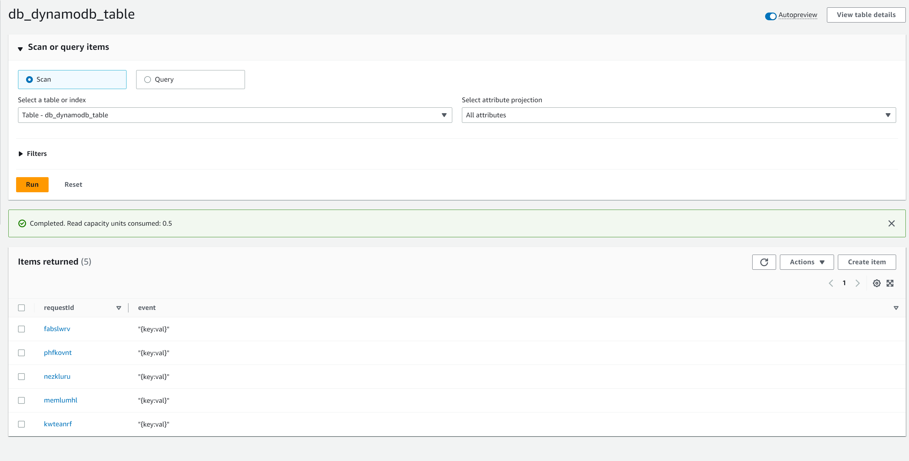
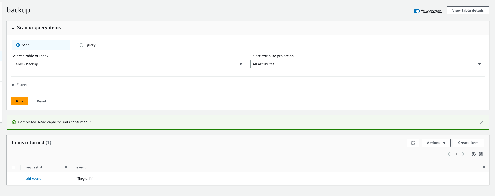

## Disaster Strategy Overview

Event processing flow represented in this repo has two persitance storages - S3 and dynamodb. While S3 doesn't require a backup plan because of induvidual objects' immutability, dynamodb stores all data in a single table and thus requires a defined backup-restore process.  

## How To Load Backup

1. Open dynamodb in AWS console
2. Click on `db_dynamodb_table`
3. Select `backups` tab
4. Click on `restore` button
5. Define name for a table and precise time of backup
6. Wait until restoration process is complete

Img 1 - Before the backup

Img 2 - After the backup

